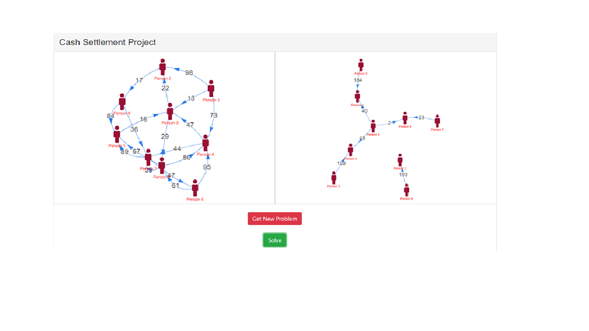

# cash-settlement-project

An interactive project built using HTML, CSS, and Javascript which is used to solve complex cash transactions(dynamically generated). It uses Apache servers to generate dynamic input values and Binary heap algorithm is implemented for space and time optimisations.

